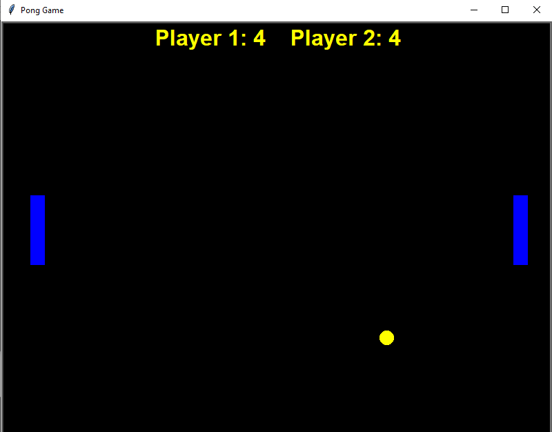

# Pong-Game 

- **To get started with python I tried implementing ping-pong game.**
- Here in this program I have used **_turtle library_** for the graphics.
- Following is the output Image :smile:

